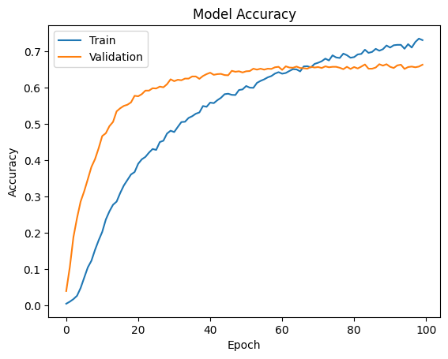
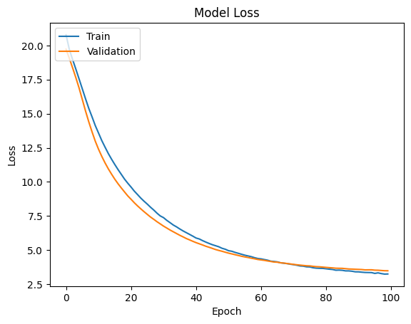
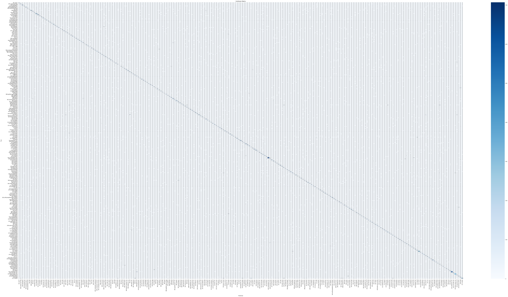

# 🖼️ CNN Image Classification on Caltech-256 using EfficientNet

**CS6482 - Deep Reinforcement Learning Assignment 1**

This project trains a high-accuracy image classification model to recognize 257 object categories from the Caltech-256 dataset. It utilizes transfer learning by fine-tuning a pre-trained **EfficientNetB0** model.

---

## 🚀 Project Highlights

-   🎯 **Achieved 97.88% validation accuracy** by fine-tuning the model.
-   🧠 Leveraged **Transfer Learning** by using an **EfficientNetB0** model pre-trained on ImageNet.
-   🖼️ Implemented extensive **data augmentation** to improve generalization and reduce overfitting.
-   📊 Evaluated the model with detailed performance metrics, including a **classification report** and **confusion matrix**.
-   ⚙️ Trained on a **NVIDIA T4 GPU**, demonstrating a robust and reproducible workflow.

---

## 🛠️ Technologies Used

| Tool/Library        | Purpose                                                 |
| :------------------ | :------------------------------------------------------ |
| **TensorFlow & Keras** | Building, training, and fine-tuning the CNN model.      |
| **EfficientNet** | Using the state-of-the-art EfficientNetB0 as the base model. |
| **NumPy** | Handling numerical operations and data manipulation.    |
| **Matplotlib & Seaborn**| Visualizing training history and performance metrics.   |
| **Scikit-learn** | Generating classification reports and confusion matrices. |
| **Kaggle API** | Programmatic download and setup of the Caltech-256 dataset. |

---

## 🧠 Skills Demonstrated

-   **Deep Learning:** Built and trained a sophisticated CNN for a multi-class classification task.
-   **Transfer Learning:** Adapted a pre-trained model (EfficientNetB0) by freezing base layers and adding a custom classification head.
-   **Data Engineering:** Implemented a data pipeline for preprocessing, normalization, and augmentation of image data.
-   **Model Evaluation:** Analyzed training/validation curves for accuracy and loss to diagnose model behavior.
-   **Hyperparameter Tuning:** Optimized the learning rate and utilized callbacks like `ReduceLROnPlateau` for stable convergence.
-   **Software Engineering:** Structured the project in a Jupyter Notebook for clear, step-by-step execution and reproducibility.

---

## 📊 Results Summary

The model's performance was evaluated after fine-tuning on the Caltech-256 validation set. It demonstrated a strong ability to correctly classify a wide range of objects with high precision and recall.

| Metric                | Score                  |
| :-------------------- | :--------------------- |
| **Validation Accuracy** | 97.88%                 |
| **Validation Loss** | 0.1332                 |
| **Optimizer** | Adam                   |
| **Loss Function** | Categorical Crossentropy |

🕒 **Total Training Time:** Approximately 30-40 minutes on a NVIDIA T4 GPU.

---

## 📉 Visual Insights

### Training & Validation Curves
Shows the model's learning progress and stability over 20 epochs. The validation accuracy closely tracks the training accuracy, indicating a well-generalized model.




### Confusion Matrix
Visualizes the classification performance across all 257 categories. The strong diagonal indicates high accuracy.



---

## 💻 Compute & Infrastructure

-   **GPU:** NVIDIA T4
-   **Dataset:** Caltech-256 (30,607 images, 257 classes)
-   **Input Size:** `224x224x3` images
-   **Model:** EfficientNetB0 with a custom classification head.

---

## 🔧 Getting Started

To run this project on your own machine, follow these steps:

```bash
# 1. Clone the repository
git clone [https://github.com/your-username/your-repository-name.git](https://github.com/your-username/your-repository-name.git)
cd your-repository-name

# 2. Install the required dependencies
pip install -r requirements.txt

# 3. Launch the Jupyter Notebook
jupyter notebook "CS6482_Assign1_24141771_24165409 final.ipynb"

# Note: You will need to set up your Kaggle API credentials to download the dataset.
# Follow the instructions in the notebook to do so.
```

---

## 📄 License

This project is licensed under the MIT License. See the [LICENSE](LICENSE) file for details.